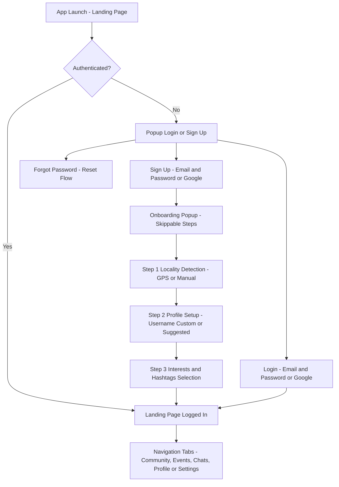
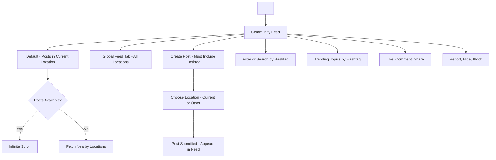
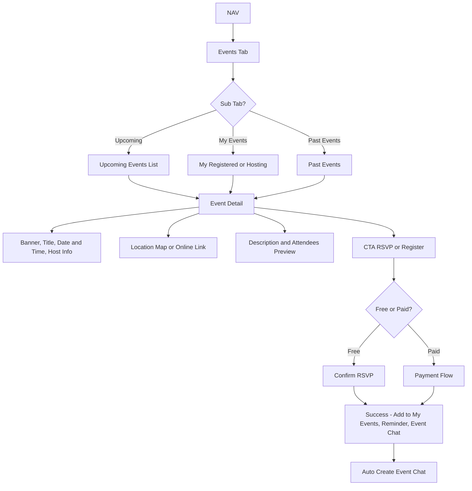
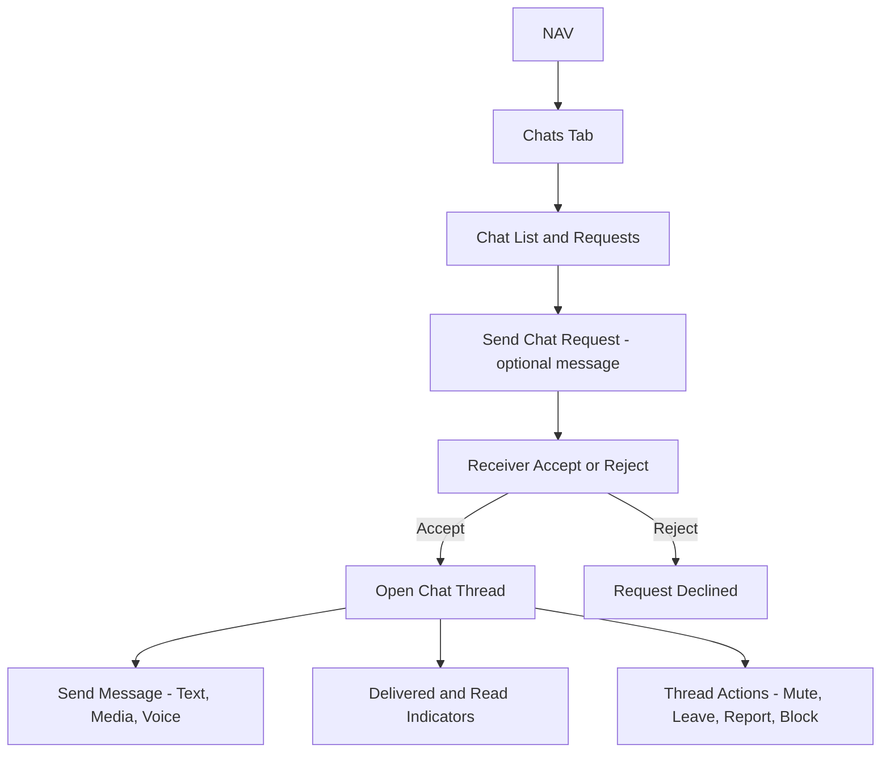
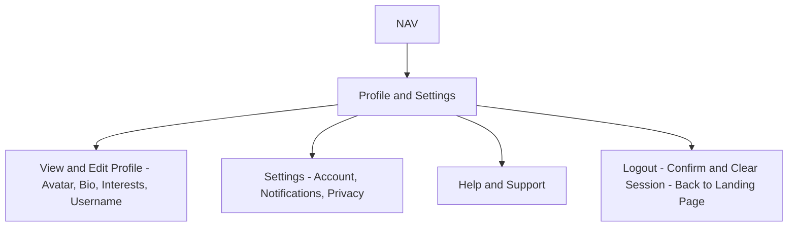

# Nxtup Social — Updated User Flow (Events, Community, Chats)

Paste this into any Mermaid-compatible viewer (Mermaid Live, VS Code Mermaid extension, Notion, Obsidian) or render via CI to export SVG/PNG.

---

## 1. Landing Page and Onboarding

---

## 2. Community Feed

---

## 3. Events

---

## 4. Chats

---

## 5. Profile and Settings

