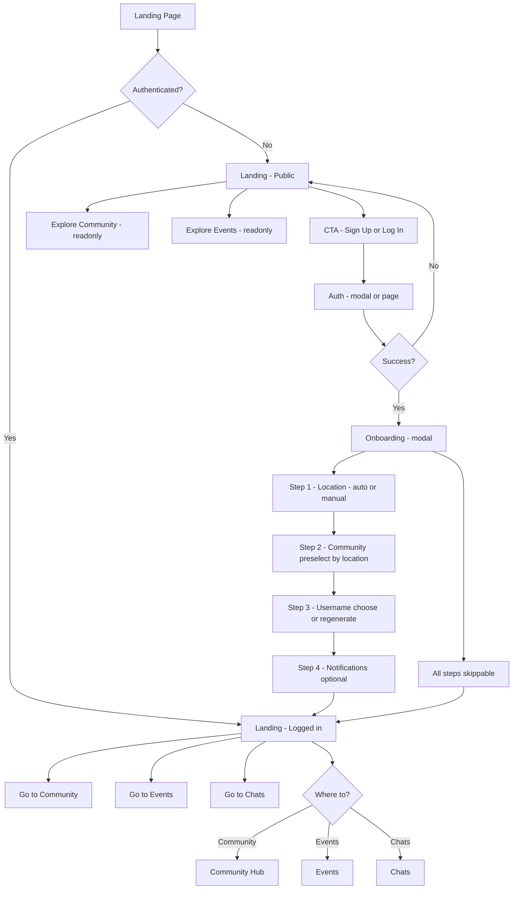
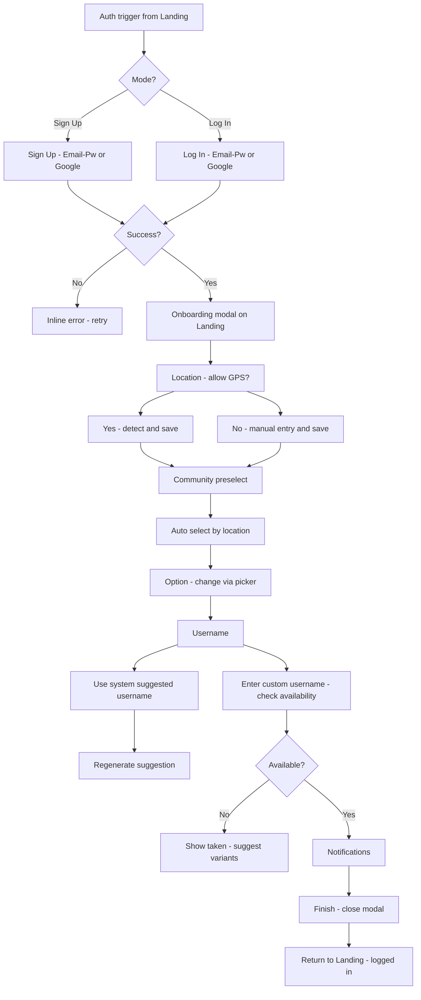
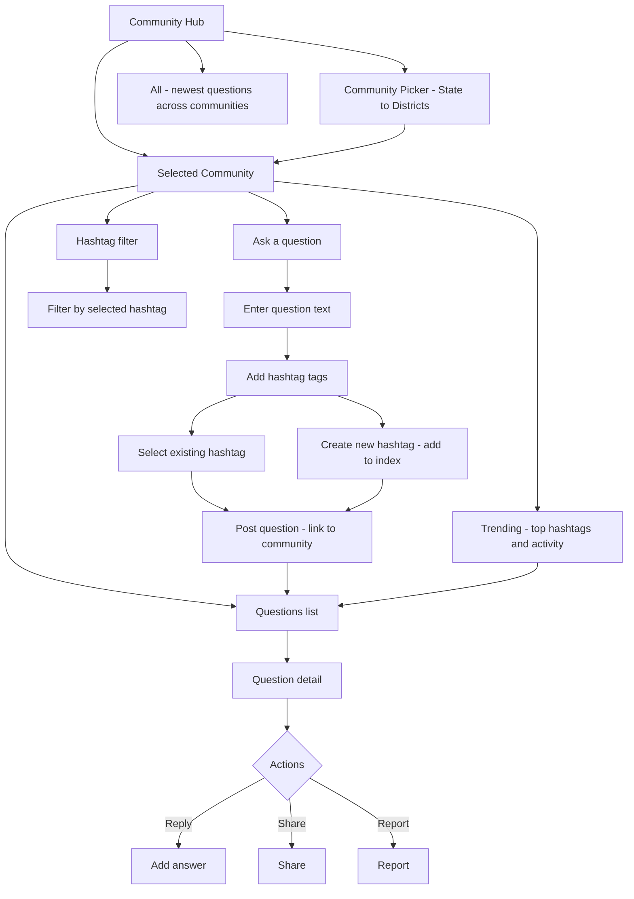
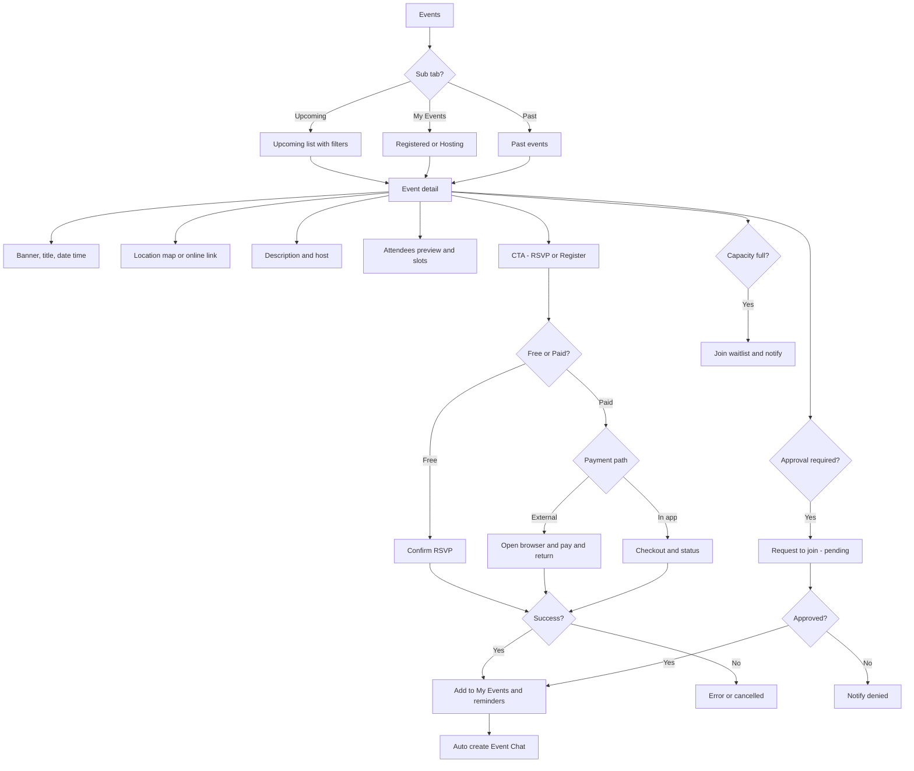
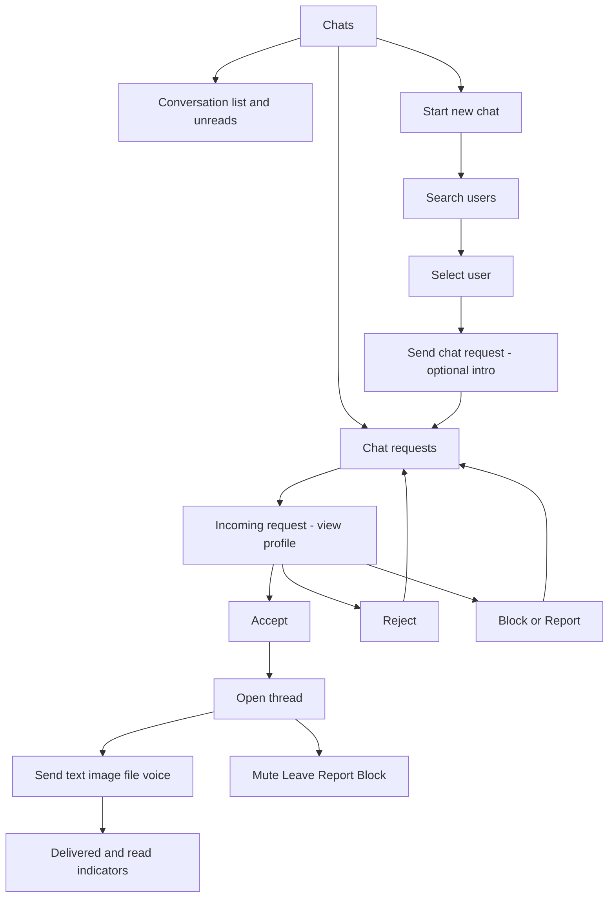
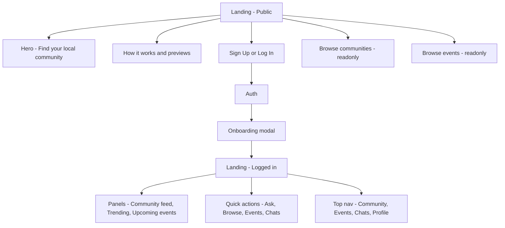
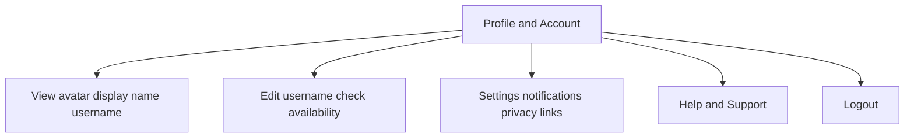

# Nxtup Social — New User Flows (Events · Community · Chats) — GitHub‑Safe Mermaid

## 0. Master App Flow (Landing-centric, pre/post-auth)

---

## 1. Authentication and Onboarding (on Landing, modal)

---

## 2. Community (location-based, no user-created groups)

---

## 3. Events (reuse current event logic)

---

## 4. Chats (request-based DM)

---

## 5. Landing Page (states and navigation)

---

## 6. Profile and Settings (lightweight)

