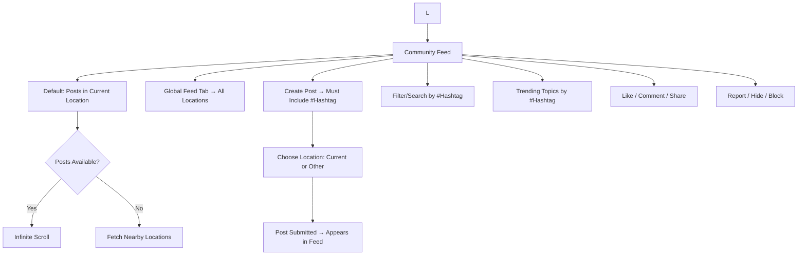
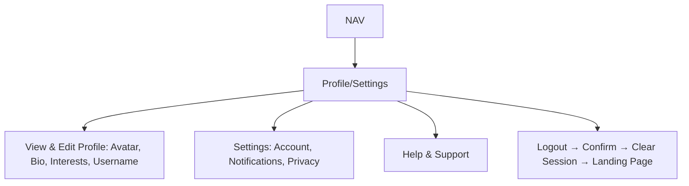

# Nxtup Social — Updated User Flow (Events, Community, Chats)

Paste this into any Mermaid-compatible viewer (Mermaid Live, VS Code Mermaid extension, Notion, Obsidian) or render via CI to export SVG/PNG.

---

## 1. Landing Page & Onboarding

```mermaid
flowchart TD
  A[App Launch → Landing Page]

  %% Auth Entry
  A --> B{Authenticated?}
  B -- No --> C[Popup: Login / Sign Up]
  B -- Yes --> L[Landing Page - Logged In]

  %% Login/Signup
  C --> C1[Login: Email + Password / Google]
  C --> C2[Sign Up: Email + Password / Google]
  C --> C3[Forgot Password → Reset Flow]

  %% After Signup → Onboarding popup
  C2 --> O1[Onboarding Popup - Skippable Steps]
  O1 --> O2[Step 1: Locality Detection (GPS / Manual)]
  O2 --> O3[Step 2: Profile Setup → Username (Custom or Suggested)]
  O3 --> O4[Step 3: Interests + Hashtags Selection]
  O4 --> L

  %% Login success
  C1 --> L

  %% Landing Page logged in
  L --> NAV[Navigation Tabs: Community | Events | Chats | Profile/Settings]
```

---

## 2. Community (Feed)



---

## 3. Events


---

## 4. Chats

```mermaid
flowchart TD
  NAV --> CH[Chats Tab]
  CH --> CHL[Chat List + Requests]

  %% Requests
  CHL --> RQ1[Send Chat Request (with/without message)]
  RQ1 --> RQ2[Receiver Accept/Reject]
  RQ2 -- Accept --> CT[Open Chat Thread]
  RQ2 -- Reject --> RJ[Request Declined]

  %% Chat Thread
  CT --> M1[Send Message: Text / Media / Voice]
  CT --> M2[Delivered/Read Indicators]
  CT --> M3[Thread Actions: Mute, Leave, Report/Block]
```

---

## 5. Profile & Settings


