# Nxtup Social — Complete Mermaid.js User Flows

Paste this file into any Mermaid-compatible viewer (Mermaid Live, VS Code Mermaid extension, Notion, Obsidian) or render via CI to export SVG/PNG.

---

## 1. Authentication & Onboarding

### 1.1 Login / Sign Up
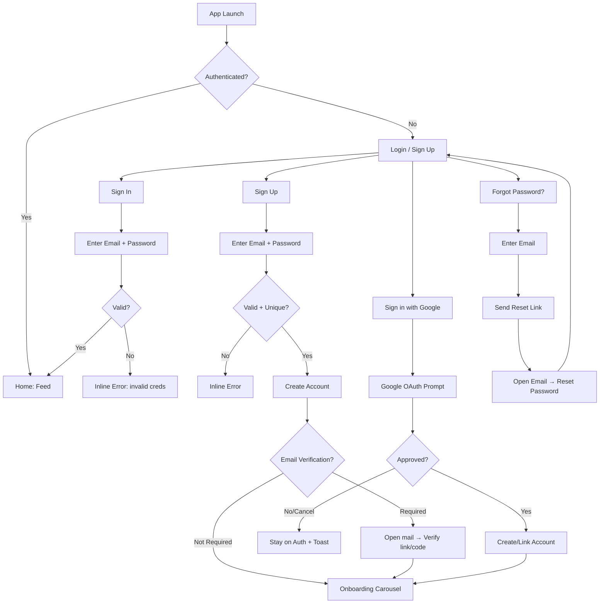

### 1.2 Onboarding Carousel - Locality + Interests
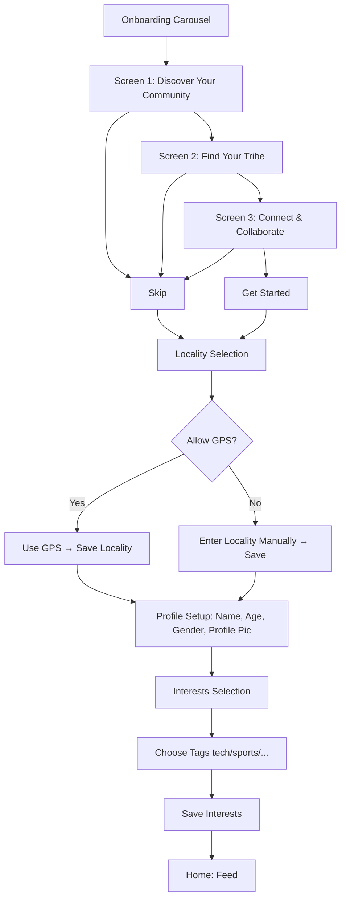

---

## 2. Core Tabs

### 2.1 Feed - Home
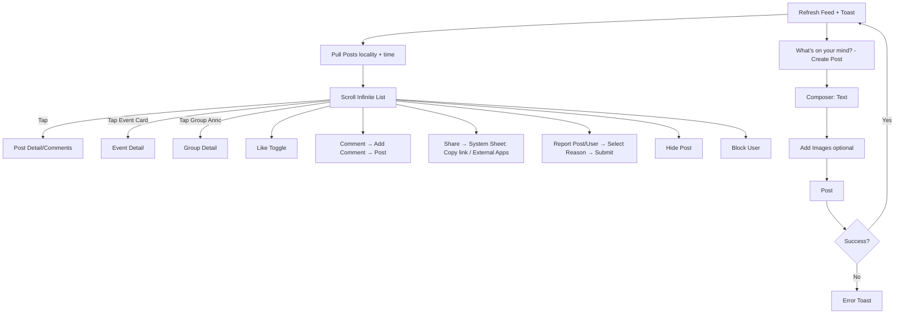

### 2.2 Events - Tabs: Upcoming, My Events, Past
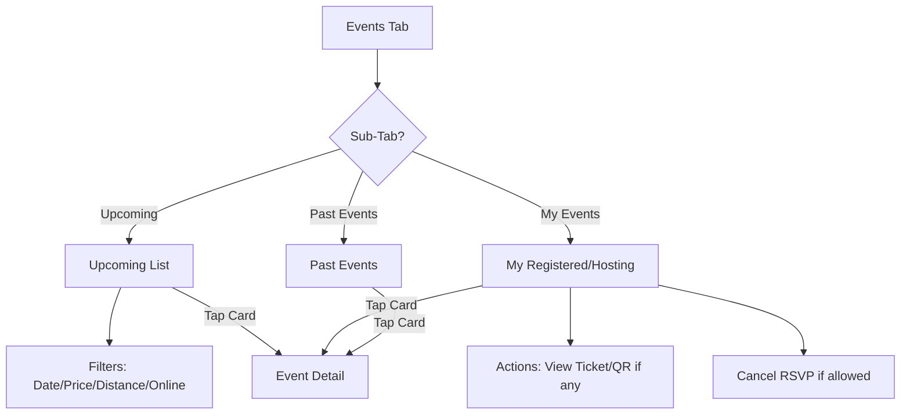

### 2.2.a Event Detail
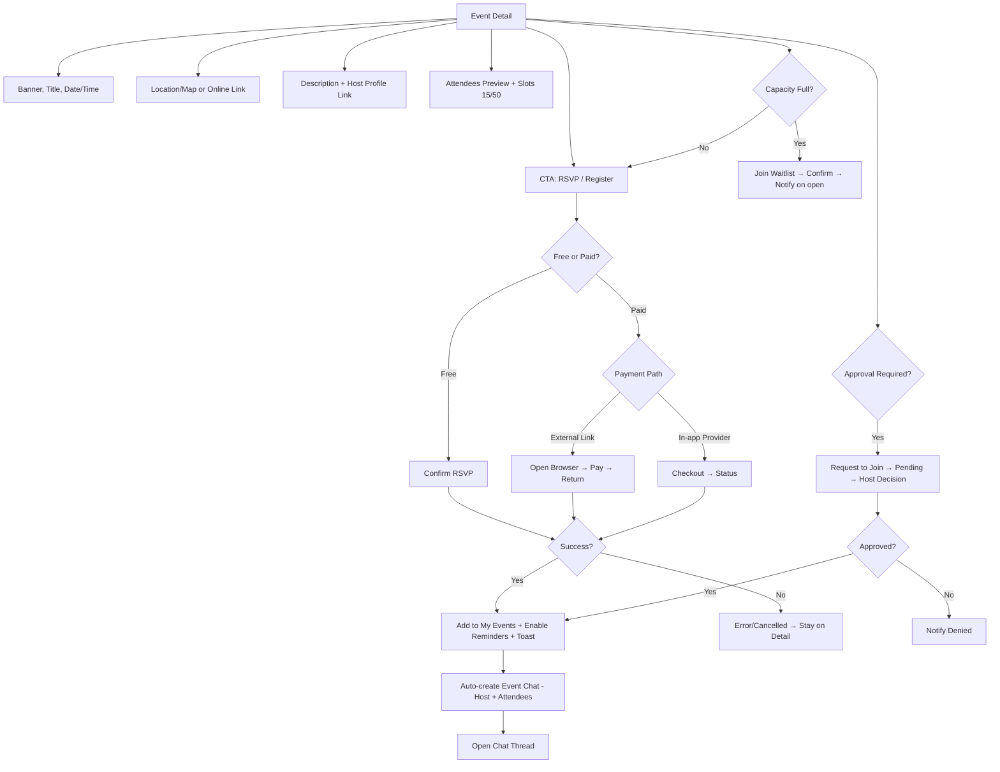

### 2.3 Groups - Tabs: My Groups, Discover
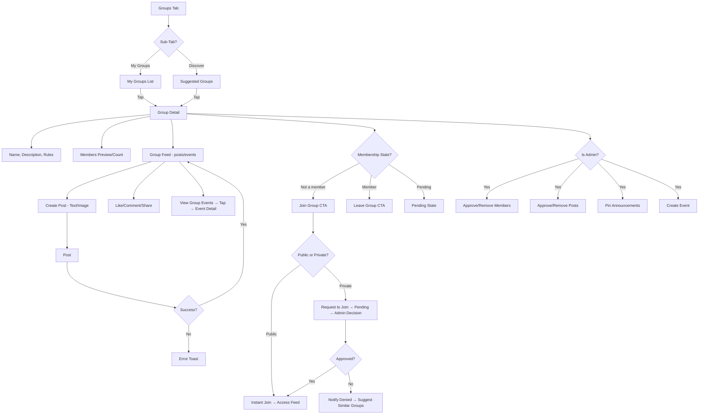

### 2.4 Chat - List, Requests, Thread
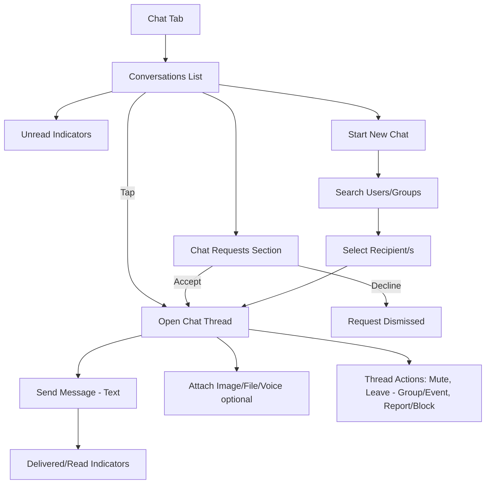

---

## 3. Side Navigation

### 3.1 Side Menu - Profile, Settings, Help, Logout
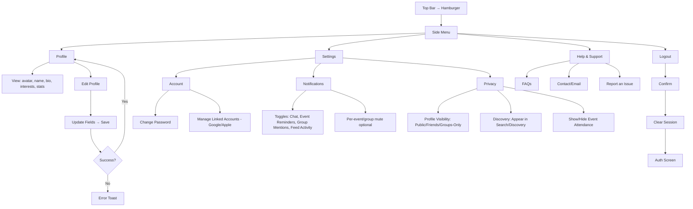

---

## 4. Supplemental/Conditional

### 4.1 Event Creation - Host
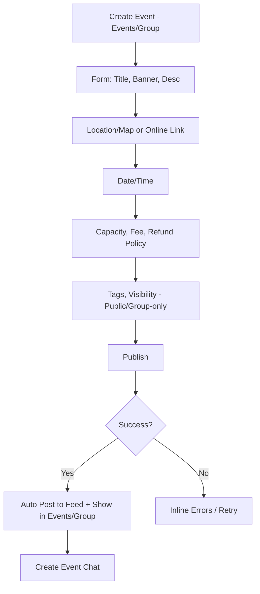

### 4.2 Error & Safety - global
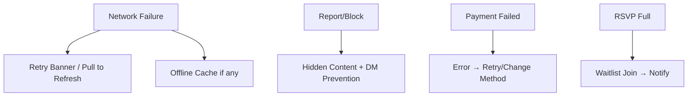

---

## 5. Master App Flow - Happy Path
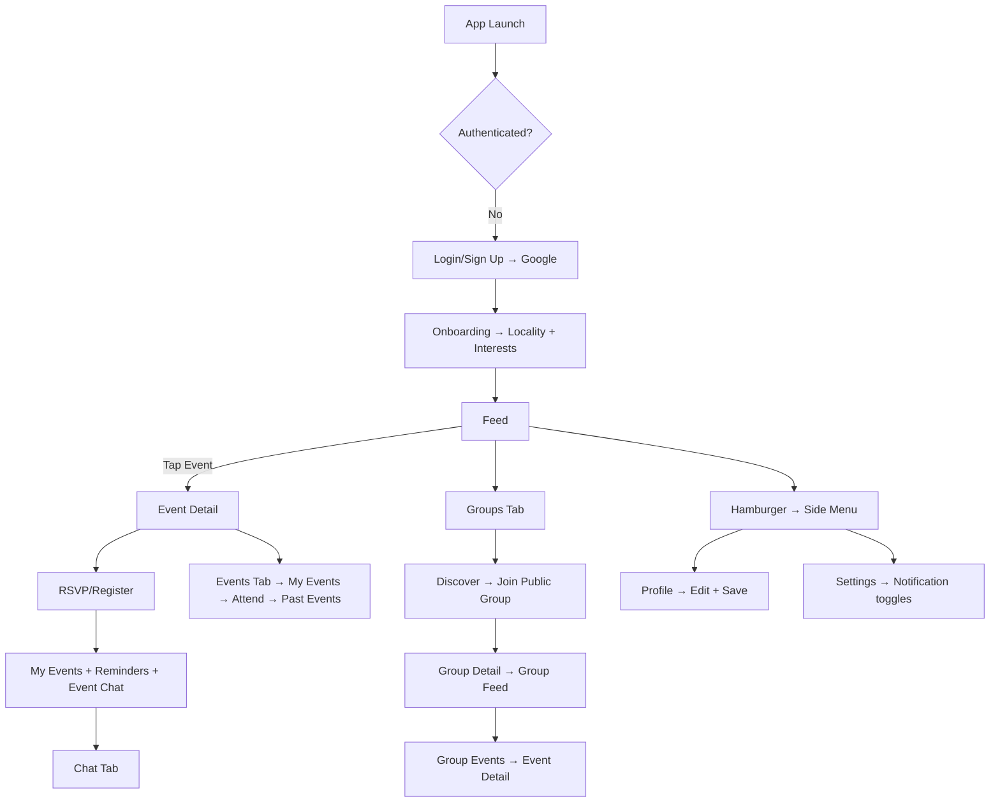
